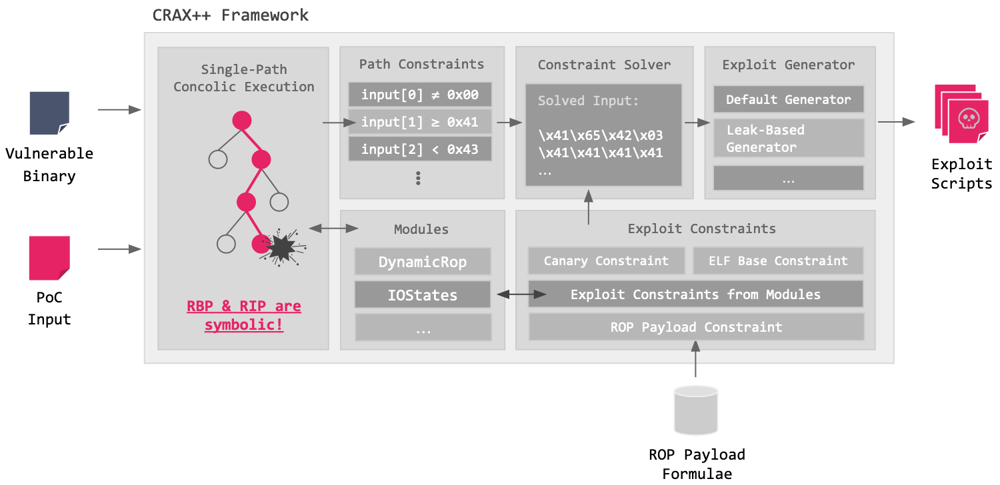
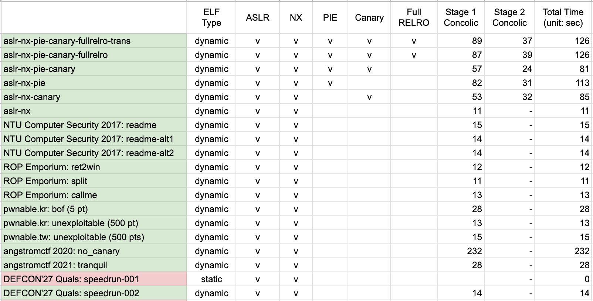

# CRAXplusplus (CRAX++)

**current version: 0.2.1**

CRAXplusplus is an **exploit generator** based on [S2E](http://s2e.systems/). Given a x86_64 binary program and a PoC input, our system leverages dynamic symbolic execution (i.e. [concolic execution](https://en.wikipedia.org/wiki/Concolic_testing)) to collect the path constraints determined by the PoC input, add exploit constraints to the crashing states, and query the constraint solver for exploit script generation. Our system supports custom exploitation techniques and modules with the aim of maximizing its extensibility. We implement several binary exploitation techniques in our system, and design two ROP payload chaining algorithms to build ROP payload from multiple techniques. In addition, we implement two modules: IOStates and DynamicRop. The former adapts the methodology of [LAEG](#reference) to the multi-path execution environment in S2E, and the latter enables our system to dynamically perform ROP inside S2E as it adds exploit constraints. Our results show that provided the target binary contains an adequate amount of input and output states to perform information leak, CRAXplusplus can still generate a working exploit script even when all the exploit mitigations are enabled at the same time, and even in the presence of basic input transformations.

## System Architecture

## Trophies

Experimental Setup:

* Binaries are compiled as 64-bit ELF with gcc 9.3.0 (Ubuntu 9.3.0-17ubuntu1~20.04)
* Binaries are concolically executed in S2E guest (Debian 9.2.1 x86_64, 4.9.3-s2e) using libc/ld 2.24
* All generated exploit scripts are verified in host (Ubuntu 20.04.1 x86_64, 5.11.0-46-generic) using libc/ld 2.24

## Quick Start \[WIP]

Introduction

* [Building CRAX++](Documentation/Build.md)
* Usage
* Reproducing experiments from the `examples` directory
* What is a Module?
* What is a Technique?

Extending CRAX++

* [Register API](Documentation/API.md#register)
* [Memory API](Documentation/API.md#memory)
* [Virtual Memory Map API](Documentation/API.md#virtual-memory-map)
* [Disassembler API](Documentation/API.md#disassembler)
* [Logging API](Documentation/API.md#logging)
* Instruction hooks
* Syscall hooks
* [How to add a Module](Documentation/Module.md)
* How to add a Technique

## Special Thanks (Listed Lexicographically)

This project is impossible without:

* [Balsn CTF Team](https://github.com/balsn) and Network Security Lab, NTU
* S2E: [Vitaly Chipounov](https://github.com/vitalych/) and all the S2E authors/contributors
* Software Quality Lab, NYCU

## Reference

[1] Vitaly Chipounov, Volodymyr Kuznetsov, and George Candea. “S2E: A platform for in-vivo multi-path analysis of software systems”. Acm Sigplan Notices 46.3 (2011), pp. 265–278. [[Paper](https://dslab.epfl.ch/pubs/selsymbex.pdf)] [[Repo](https://github.com/S2E/s2e)] [[Docs](http://s2e.systems/docs/)]

[2] Shih-Kun Huang et al. “Crax: Software crash analysis for automatic exploit generation by modeling attacks as symbolic continuations”. In: 2012 IEEE Sixth International Conference on Software Security and Reliability. IEEE. 2012, pp. 78–87. [[Paper](https://ir.nctu.edu.tw/bitstream/11536/24012/1/000332520700022.pdf)] [[Repo](https://github.com/SQLab/CRAX/tree/workable)] [[Article](https://skhuang.web.nctu.edu.tw/research/)]

[3] Mow Wei Loon and Hsiao Hsu-Chun. “Bypassing ASLR with Dynamic Binary Analysis for Automated Exploit Generation” (2021). [[Paper](https://www.airitilibrary.com/Publication/alDetailedMesh1?DocID=U0001-0508202117214500)]

## License

Licensed under MIT. Copyright 2021-2022 Software Quality Laboratory, NYCU.
